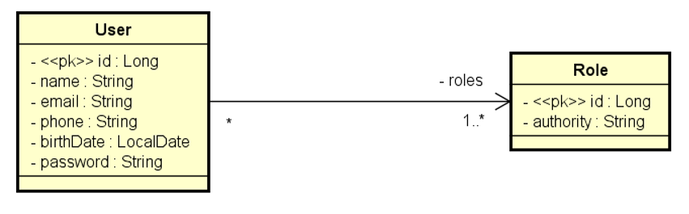

# Controle de acesso

---
### I - Modelo de dados
A implementação do controle de acesso nessa aplicação será feita por ***perfis de usuário*** (roles).

Para isso, primeiramente é necessário implementar um modelo de dados para armazenar esses perfis de usuário. A
imagem abaixo ilustra esse modelo:


Cada usuário pode ter vários perfis de acesso, e cada perfil pode ser de vários usuários.

---
### II - Spring Boot Security
O Spring Security é um framework do ecossistema Spring que oferece soluções de segurança.

O Spring Security oferece recursos para **autenticação** (provar quem é o usuário) e **autorização** (definir
quem pode acessar/modificar qual recurso), além de integração com **Oauth2, JWT, LDAP, etc**. 
Também conta com recursos de proteção de ataques comuns, como: CSRF, XSS, Clickjacking.

##### Conceitos básicos:
>**Autenticação**
>
> É o ato de identificar quem está enviando uma request. No Security a autenticação é tratada por:
> + **AuthenticationManager**: gerencia a autenticação;
> + **UserDetailService**: busca as informações do usuário no banco de dados;
> + **PasswordEncoder**: valida e codifica senhas.

>**Autorização**
> 
> Depois de autenticar o usuário, o sistema define o que o usuário pode ou não acessar ou modificar. É possível
> definir regras de autorização através de:
> + **Roles**: papéis atribuídos a cada tipo de usuário da aplicação;
> + **Authority**: permissão mais granular de acesso;
> + **Anotações**: `@PreAuthorize`, `@Secured`, `@RolesAllowed`.

Para usar o Spring Security na aplicação, é necessário adicionar a dependência no pom.xml:
```xml
		<dependency>
			<groupId>org.springframework.boot</groupId>
			<artifactId>spring-boot-starter-security</artifactId>
		</dependency>

		<dependency>
			<groupId>org.springframework.security</groupId>
			<artifactId>spring-security-test</artifactId>
			<scope>test</scope>
		</dependency>
```
###NOTES